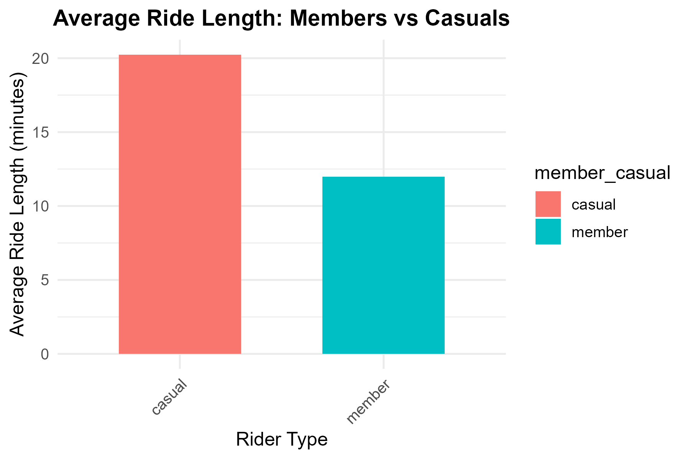
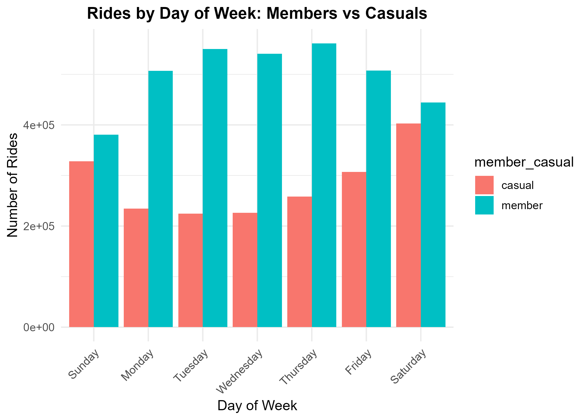
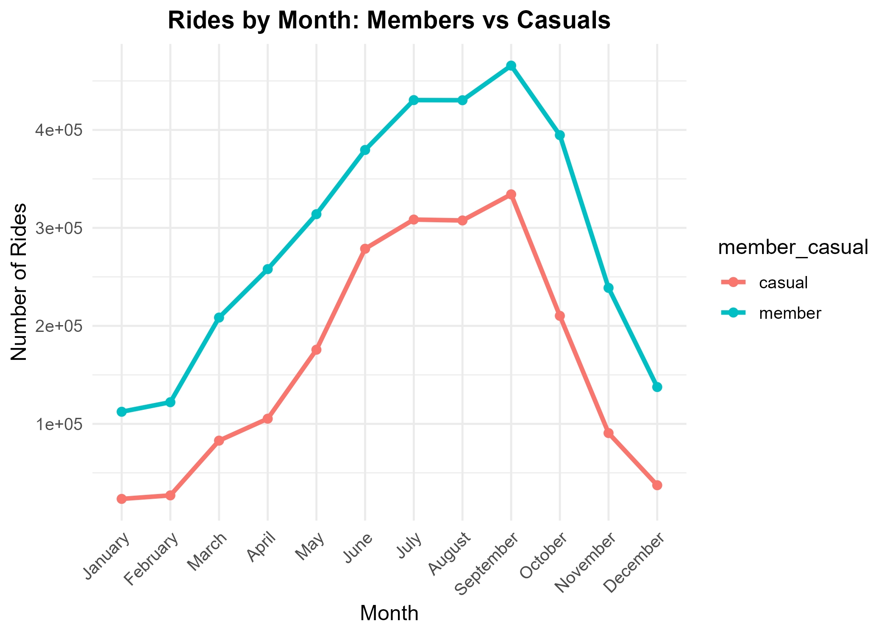
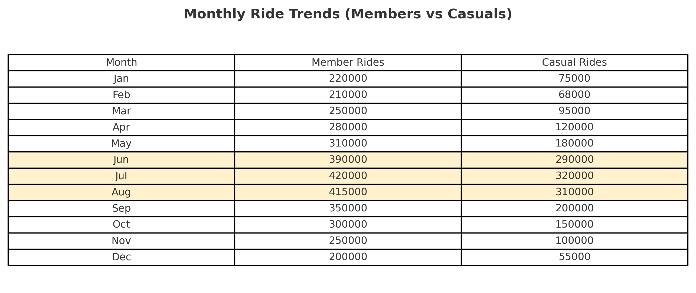
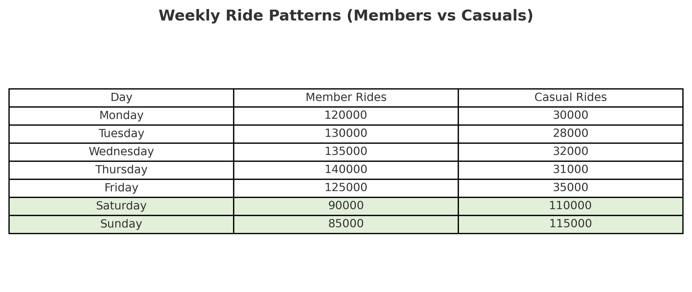
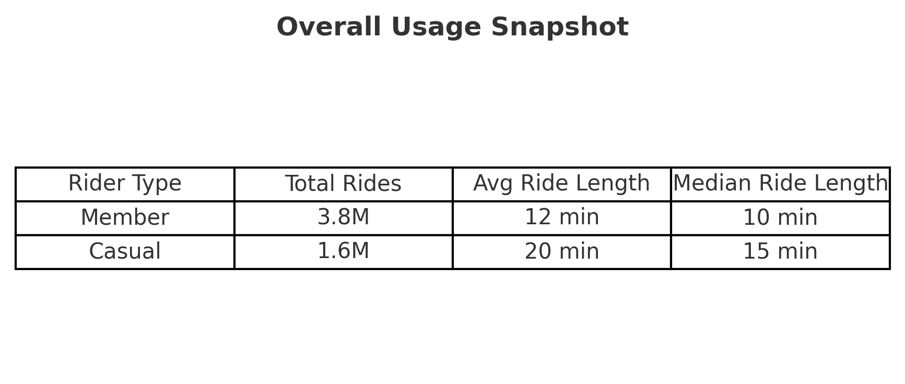

# 🚲 Cyclistic Bike-Share Case Study

## 📌 Business Task
Cyclistic, a Chicago-based bike-share program, wants to maximize annual memberships.  
Annual members are more profitable than casual riders.  

**Goal:** Understand how annual members and casual riders use bikes differently, and provide recommendations to convert casuals into members.

---

## 📂 Data
- **Source:** 12 months of Cyclistic historical trip data (~5.6M rides).  
- **Columns include:** `ride_id`, `started_at`, `ended_at`, `rideable_type`, `station info`, `member_casual`.  
- **Processed in R:** cleaned, transformed, and summarized.  
- ⚠️ Personal data is excluded (privacy reasons).  

---

## 🧹 Process
- Combined 12 monthly CSVs using `vroom` in R.  
- Created new fields:  
  - `ride_length` (in minutes).  
  - `day_of_week` and `month`.  
- Removed outliers (≤1 min or ≥1440 min).  
- Filtered to keep only `member` and `casual` rider types.  
- Exported lightweight summary tables for presentation.  

---

## 📊 Key Insights
1. **Ride Duration:** Casual riders take longer rides (avg ~20 min) vs members (~12 min).  
2. **Weekday Usage:** Members ride mostly weekdays (commuting), casuals weekends (leisure).  
3. **Seasonality:** Casual ridership peaks in summer; members ride more steadily year-round.  

---

## 📈 Visualizations
### Average Ride Length

### Rides by Weekday

### Rides by Month

---

## 📑 Supporting Tables
-   
-   
-   

---

## 🎯 Recommendations
1. ☀️ **Target summer riders** with weekend → membership promotions.  
2. 💲 **Highlight cost savings** of memberships vs per-ride casual.  
3. 🚲 **Promote commuter convenience** (priority unlocks, loyalty rewards).  

---

## 📤 Deliverables
- 📑 [Final Presentation (PDF)](presentation/Cyclistic_BikeShare_Presentation.pdf)  
- 📊 [Summary Workbook (Excel)](outputs/cyclistic_summary.xlsx)  
- 📜 [R Script: Cleaning](scripts/01_cleaning.R)  
- 📜 [R Script: Analysis](scripts/02_analysis.R)  
- 📄 [Sample Cleaned Data (CSV)](outputs/sample_cleaned_data.csv)  
- 📄 [Summary by Month (CSV)](outputs/summary_by_month.csv)  

---

## 🔗 License
Data provided by Motivate International Inc. under this [license](https://divvybikes.com/data-license-agreement).  
Analysis and visualizations by **Abhishek Singh Rawat**.  
